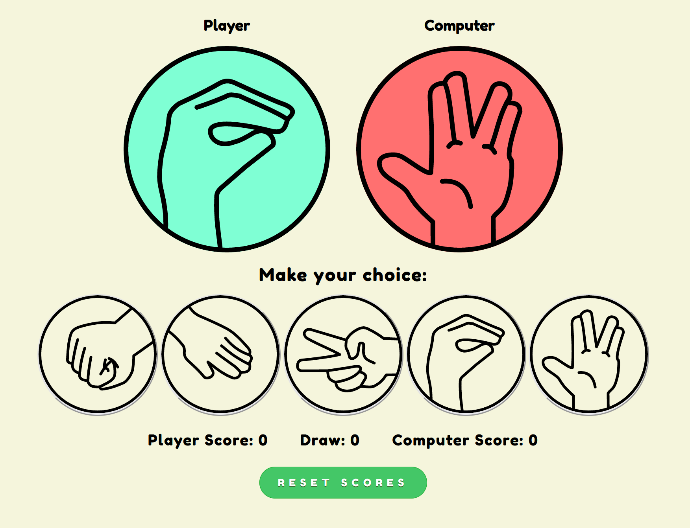
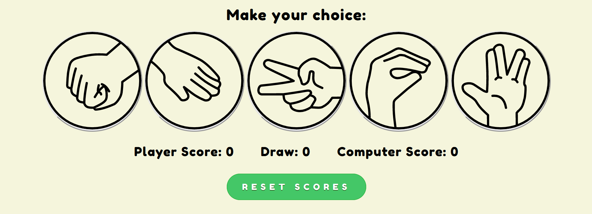
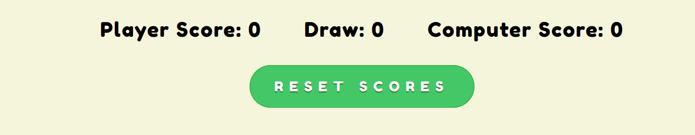
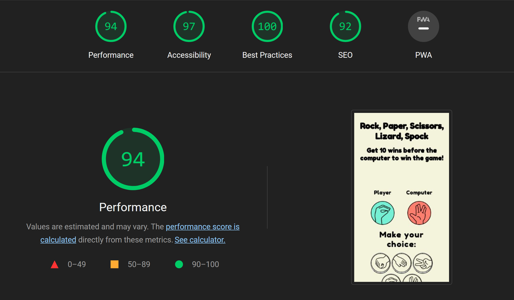

# Rock Paper Scissors Lizard Spock

Rock Paper Scissors Lizard Spock is a spin-off version of the original Rock Paper Scissors game that was first introduced in the hit television show The Big Bang Theory. The game allows for more variaty in the decision making with the additional Lizard and Spock options to choose from.
To win the game you will have to win 10 matches againt the computer whos moves are randomized making this the perfect decision making game.  

## Features 

### Existing Features

- __Header and Subheader__

  - At the top of the page the heading shows the name of the game: Rock Paper Scissors Lizard Spock in an easy to see font. When viewing the name the user will easily be able to know what game is being played.
  - The subheading: "Get 10 wins before the computer to win the game" can be found under the heading explaining the requirements for winning the game.

- __The Game Results__

  - This area shows the options that the player and computer have selected. The player on the left and the computer on the right.
  - When the player selects an option the code will randomly select an option for the computer. The winner is then determined. 
  - 

- __The Player Options__

  - The Players options includes clear instructions for the user to make a selection between the available buttons.
  - The buttons provide feedback for the user such as hovering and changing color once clicked on.

- __The Score Area__

  - This section will allow the user to see exactly how many matches the player has one, how many the computer has won, and how many have resulted in a draw.

- __The Footer__

- In the footer the user will be able to read about the rules of the game.

### Features Left to Implement

- Player vs Player option making it possible for users to play against others.
- Option to change the amount of wins that have to be reached to win.
- Backend for users to be able to login and save their games.

## Testing 

- I tested playing the game in different browsers including Chrome, Firefox and Safari.
- I confirmed that the game results are always correct.
- I confirmed that the header, rules, buttons are readable and easy to understand.
- I confirmed that the colors and fonts are easy to read and accessible by running it through lighthouse.

### Validator Testing 

- HTML
    - No errors were returned when passing through the official [W3C validator](https://validator.w3.org/nu/?doc=https%3A%2F%2Fdavidabrahamy10.github.io%2Frock-paper-scissors-lizard-spock%2F)
- CSS
    - No errors were found when passing through the official [(Jigsaw) validator](https://jigsaw.w3.org/css-validator/validator?uri=https%3A%2F%2Fdavidabrahamy10.github.io%2Frock-paper-scissors-lizard-spock%2F&profile=css3svg&usermedium=all&warning=1&vextwarning=&lang=en)
- JavaScript
    - One warning were found when passing through the official [Jshint validator](https://jshint.com/)
      - The following warning were found:
      - Functions declared within loops referencing an outer scoped variable may lead to confusing semantics. (playGame, buttonColor)
      - The following metrics were returned: 
      - There are 8 functions in this file.
      - Function with the largest signature take 2 arguments, while the median is 0.5.
      - Largest function has 43 statements in it, while the median is 5.5.
      - The most complex function has a cyclomatic complexity value of 41 while the median is 2.

### Unfixed Bugs

No unfixed bugs.

## Deployment

- The site was deployed to GitHub pages. The steps to deploy are as follows: 
  - In the GitHub repository, navigate to the Settings tab 
  - From the source section drop-down menu, select the Master Branch
  - Once the master branch has been selected, the page will be automatically refreshed with a detailed ribbon display to indicate the successful deployment. 

The live link can be found here - https://davidabrahamy10.github.io/rock-paper-scissors-lizard-spock/

## Credits

### Content 

- Instructions on how to declare all the DOM variables were taken from [Web Development Tutorial - JavaScript, HTML, CSS - Rock Paper Scissors Game](https://www.youtube.com/watch?v=jaVNP3nIAv0)
- Inspiration for how to structure the code was taken from [Portfolio Project Scope] (https://codeinstitute.net/se/)
- The rules in the footer was taken from [The Big Bang Theory](https://the-big-bang-theory.com/rock-paper-scissors-lizard-spock/)

### Media

- The svg files used for the buttons were taken from (https://github.com/JLChamberlain/RPSLS/tree/master/IMG/SVG)